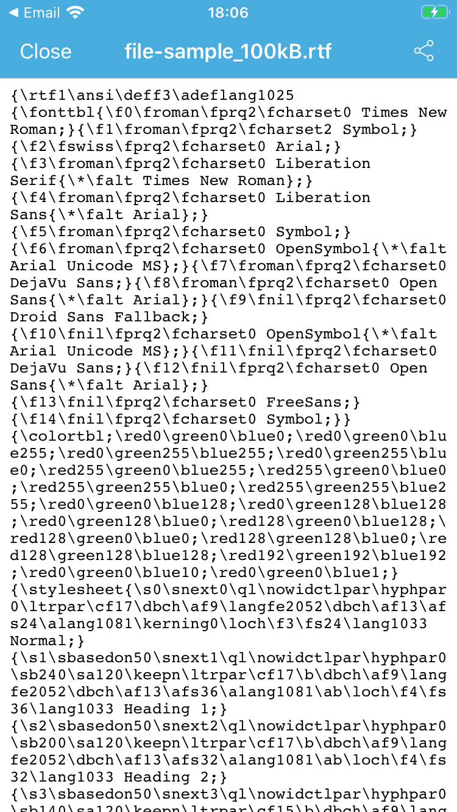
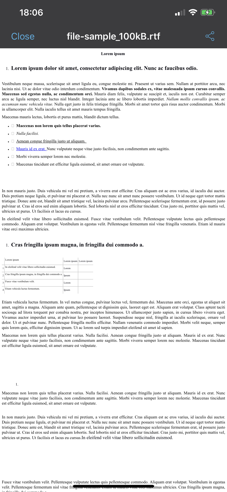

# Problem description
When trying to load a .docx or .rtf file into a WKWebView using the `-loadData:MIMEType:characterEncodingName:baseURL`, it doesn't work. Loading the same file from a web page or from a file URL works fine, meaning that the WKWebView correctly supports the file.
One possible workaround is to write the data into a file and then load the file but sometimes this is not a viable solution (e.g. client requirement that no data should be written unencrypted in the file system).

Useful info:
https://forums.developer.apple.com/thread/109589

## Workaround without writing files on disk ##
1. Use a custom scheme handler
```
WKWebViewConfiguration *configuration = [[WKWebViewConfiguration alloc] init];
id<WKURLSchemeHandler> schemeHandler = ...
[configuration setURLSchemeHandler:schemeHandler forURLScheme:@"someCustomScheme"];
WKWebView *webView = [[WKWebView alloc] initWithFrame:CGRectZero configuration:configuration];
```
2. Load the data with that custom scheme:
```
[self.webView loadRequest:[NSURLRequest requestWithURL:[NSURL urlWithString:@"someCustomScheme://name.rtf]]];
```
3. In the scheme handler, provide the data in the protocol method:
```
- (void)webView:(WKWebView *)webView startURLSchemeTask:(id<WKURLSchemeTask>)urlSchemeTask {
    NSData *data = ...
    NSURLResponse *workaroundResponse =
        [[NSURLResponse alloc] initWithURL:[NSURL urlWithString:@"someCustomScheme://name.rtf] MIMEType:@"application/rtf" expectedContentLength:data.length textEncodingName:@"utf-8"];
    // These three methods must be called and exactly in this order, if not an exception will be thrown
    [urlSchemeTask didReceiveResponse:workaroundResponse];
    [urlSchemeTask didReceiveData:data];
    [urlSchemeTask didFinish];
}
```

## Original approaches ## 
In the examples below we use data from file but in the real scenario the data doesn't come from a file and we cannot write it in disc because of security rules.

Doesn't work: treated as text, not as rtf
```
- (void)loadRTFData {
    NSURL *fileURL = [[NSBundle mainBundle] URLForResource:@"file" withExtension:@"rtf"];
    NSData *data = [NSData dataWithContentsOfURL:fileURL];
    NSString *MIMEType = @"application/rtf";
    //MIMEType = @"text/rtf";
    NSString *encodingName = @"utf-8";
    [self.webView loadData:data MIMEType:MIMEType characterEncodingName:encodingName baseURL:fileURL];
}
```




This also doesn't work: "This file cannot be previewed, it might be corrupted or of an unknown file format"
This workaround works with .docx files as seen in https://forums.developer.apple.com/thread/109589 but it doesn't for .rtf
```
- (void)loadRTFInlineDataURL {
    NSURL *fileURL = [[NSBundle mainBundle] URLForResource:@"file" withExtension:@"rtf"];
    NSData *data = [NSData dataWithContentsOfURL:fileURL];
    NSString *base64Data = [data base64EncodedStringWithOptions:kNilOptions];
    NSString *MIMEType = @"application/rtf";
    //MIMEType = @"text/rtf";
    NSString *urlString = [NSString stringWithFormat:@"data:%@;base64,%@", MIMEType, base64Data];
    NSURL *url = [NSURL URLWithString:urlString];
    NSURLRequest *request = [NSURLRequest requestWithURL:url];
    [self.webView loadRequest:request];
}
```


However, these work:
```
- (void)loadRTFRequest {
    NSURL *url = [NSURL URLWithString:@"https://file-examples.com/wp-content/uploads/2019/09/file-sample_100kB.rtf"];
    NSURLRequest *request = [NSURLRequest requestWithURL:url];
    [self.webView loadRequest:request];
}
```
```
- (void)loadRTFFile {
    NSURL *fileURL = [[NSBundle mainBundle] URLForResource:@"file" withExtension:@"rtf"];
    [self.webView loadFileURL:fileURL allowingReadAccessToURL:fileURL];
}
```


